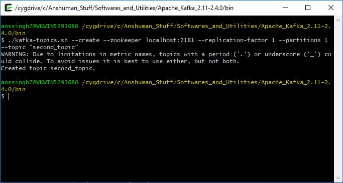

# Apache Kafka Utilities

This repository lists down important utilities shipped with Apache Kafka and their usages with examples. These utilities are shell scripts and BAT files which can be run on any OS running instances of Apache Kafka.

Starting Zookeeper
------------------
./zookeeper-server-start.sh ../config/zookeeper.properties

Starting Broker
---------------
./kafka-server-start.sh ../config/server.properties

Creating a Topic
----------------
./kafka-topics.sh --create --zookeeper localhost:2181 --replication-factor 1 --partitions 1 --topic "<TOPIC_NAME>"

e.g.
./kafka-topics.sh --create --zookeeper localhost:2181 --replication-factor 1 --partitions 1 --topic "first_topic"

Topic Description
-----------------
./kafka-topics.sh --describe  --zookeeper localhost:2181 --topic "first_topic"

Starting a Producer
-------------------
./kafka-console-producer.sh --broker-list localhost:9092 --topic "<TOPIC_NAME>"

e.g.
./kafka-console-producer.sh --broker-list localhost:9092 --topic "first_topic"

Starting a Consumer
-------------------
./kafka-console-consumer.sh --bootstrap-server localhost:9092 --topic "<TOPIC_NAME>" --from-beginning

e.g.
./kafka-console-consumer.sh --bootstrap-server localhost:9092 --topic "first_topic" --from-beginning